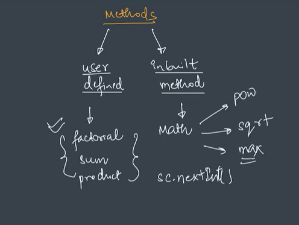

# ▶ if-else Statement:

```java
if(condition){
        code
    }else{
        code
    }
```

# ▶ else if Statement:

```java
if(condition 1){
        code
    }else if(condition 2){
        code
    }else{
        code
    }
```

# ▶ Ternary Operator:

                    Ternary Operator is an aletrnate way to write if-else.
                    unary --> 1 operand
                    binary --> 2 operands
                    ternary --> 3 operands

```java
    variable = condition? statement1 : statement2;

    boolean larger = (5>3)? 5(true):3(false);

    String type = (5%2 == 0)? "even" : "odd";
```

# ▶ Switch Statement:

```java
switch(variable){
    case 1:
            code
            break;
    case 2:
            code
            break;
    case 3:
            code
            break;
    default:
            stmt
            break;(optional)
}
```

("----Leap year logic flowchart----")

# ▶ While Loop:

```java
while(condition){
    code
}
```

# ▶ For Loop:

```java
for(initialisation; condition; updation){
    code
}
```

# ▶ do-while Loop:

```java
do{
    code
}while(condition);
```

# ▶ Break Statement:

to exit the loop

# ▶ Continue Statement:

to skip an iteration (current iteration)

## Primr number:

2,3,5,7,11...etc, and other are the composite number.

# ▶ Function/Methods

function is a reusable block of code which perform certain operations.

Jin functions ko hum classes k ander likhte hai vo us class k Method ho jate hai.

## Syntax

```java
returnType name(){
    //body (logic)
    return statement;
}
```

## Syntax with Parameters

```java
returnType name(type param1, type param2){
    //body (logic)
    return statement;
}
```

# ▶ Function Parameter V/S Argument

The variable which is used in function declaration are called Parameters or formal parameters.

The variable or values which we pass at time of calling function are called Arguments or Actual parameters.


# ▶ What happens in Memory?

variable and function both occupie memory (call stack) in Java.


# ▶ Call by Value / Call by Reference(orignal)

Java always calls by value

# ▶ Factorial

n! = n \* (n-1) \* (n-2) \* (n-3) \* .... \* 1
Factorial exist only for positive numbers. not for negative.




# ▶ Function Overloading


## Function Overloading using parameter


Function overloading does not depend on the return type of function it depends on parameter

## Function Overloading using Data Types

# ▶ Convert from Binary to Decimal


# ▶ Convert from Decimal to Binary


# ▶ Scope

## Method Scope

Inside any method we can use any variable after declaring , before declaring variable we can not use, this is called Method scope.


in line no. 3 it will give error(s cannot be resolved to a variable) because we are using s before declaring.

## Block Scope

```java
{
    //block of code
}
```


in line no. 7 it will give error(s cannot be resolved to a variable) because we are tring to access variable outside of block.

#### We also have class scope

For that we use access modifiers

1. public
2. private
3. protected

we will learn in OOP's

# ▶ Arrays:

Array has list like structure. and indexing starts from 0 called 0-based indexing.

#### Defination :

List of elements of the same type placed in a contiguous(ek k baad ek) memory location.

Java char takes up 2 bytes in memory.

## Operations in Array

1. Create
2. Input
3. Output
4. Update


here new keyword gives(allocate) us location in memory.

Array has static type(means you can not change size of array in between of execution(on run time)).

Empty array stores 0, "", ''.

#### Length of an array:

```java
arrayName.length
```

## Passing arrays as argument:

Arrays are pass by reference


## Linear Search

When we search element in alinear manner, called linear search.


In Java :<br>
-infinity = Integer.MIN_VALUE<br>
+infinity = Integer.MAX_VALUE

These are avaliable in "util" package to use them :
import java.util.\*;

function can return only one value.

## Binary Search :

Array should be sorted

